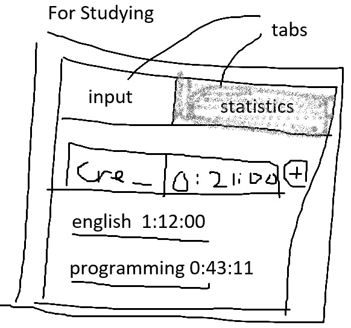

# Overview

A simple todo app built with pure JavaScript for learning purposes.

# Features

- Create todos (text + elapsed time)
- Update todos
- Delete todos
- View all todos
- Display statistics (total elapsed time)

# Image

